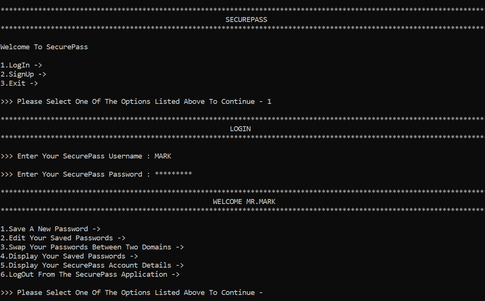

<h2>💬 Chatify Messenger™ – Instant Messaging Application</h2>

 

Designed and Developed an Instant Messaging Application called Chatify Messenger using HTML 5, CSS 3, React JavaScript, Chat Engine Software and Google Firebase Platform.

<h4>KEY FEATURES :-</h4>
 ● &nbsp;Chatify Allows You To Stay In Touch With Your Family, Friends, Colleagues, Etc By Sending A Message To Them Either Personally Or Within A Group. 
 ● &nbsp;Furthermore, You Also Have The Ability To Name Your Groups, Customize Your Chats, Disable Notifications, Etc. 
 ● &nbsp;In Addition To These Features, You Can Also Share News Articles, Photos, Videos, Documents, Slideshows, Spreadsheets, PDFs, Etc. 
 ● &nbsp;Finally, Your Messages Are Completely Protected Through Chatify Because They Are End-To-End Encrypted. 

<h4>APPLICATION URL :-</h4>
💬 Chatify Messenger™ - https://chatifymessengerapplication.netlify.app/

<h4>LICENSE AGREEMENT :-</h4>
Released Under Massachusetts Institute Of Technology License. 

Permission Is Hereby Granted, Free Of Charge, To Any Person Obtaining A Copy Of This Software And Associated Documentation Files (The "Software"), To Deal In The Software Without Restriction, Including Without Limitation The Rights To Use, Copy, Modify, Merge, Publish, Distribute, Sublicense, And/Or Sell Copies Of The Software, And To Permit Persons To Whom The Software Is Furnished To Do So, Subject To The Following Conditions - 

1.&nbsp;The Below Copyright Notice And This Permission Notice Shall Be Included In All Copies Or Substantial Portions Of The Software.

2.&nbsp;The Software Is Provided "As Is", Without Warranty Of Any Kind, Express Or Implied, Including But Not Limited To The Warranties Of Merchantability, Fitness For A Particular Purpose And Noninfringement. In No Event Shall The Original Author Or Copyright Holder Be Liable For Any Claim, Damages Or Other Liability, Whether In An Action Of Contract, Tort Or Otherwise, Arising From, Out Of Or In Connection With The Software Or The Use Or Other Dealings In The Software. 

<h4 align="center">Copyright © 2021 Mohnishh Sivan | Chatify Messenger™ | All Rights Reserved</h4>
